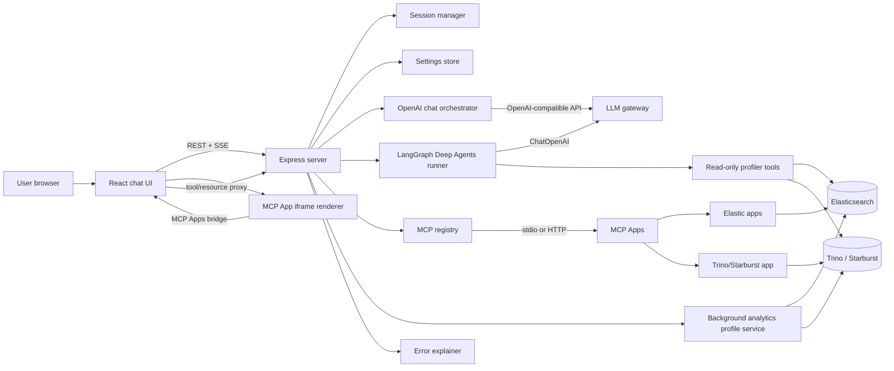
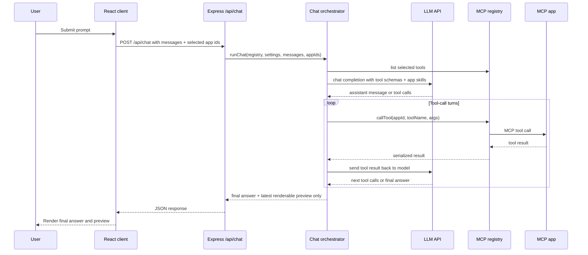
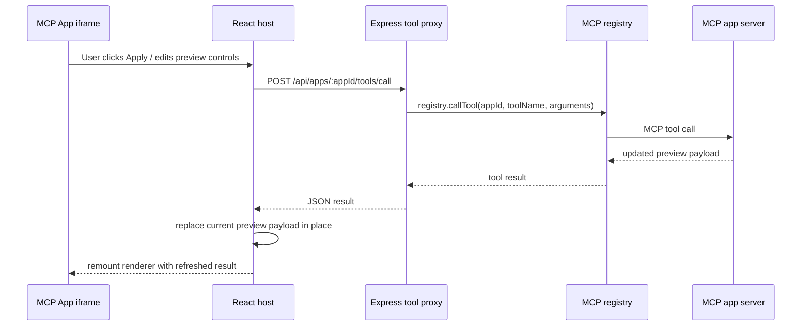
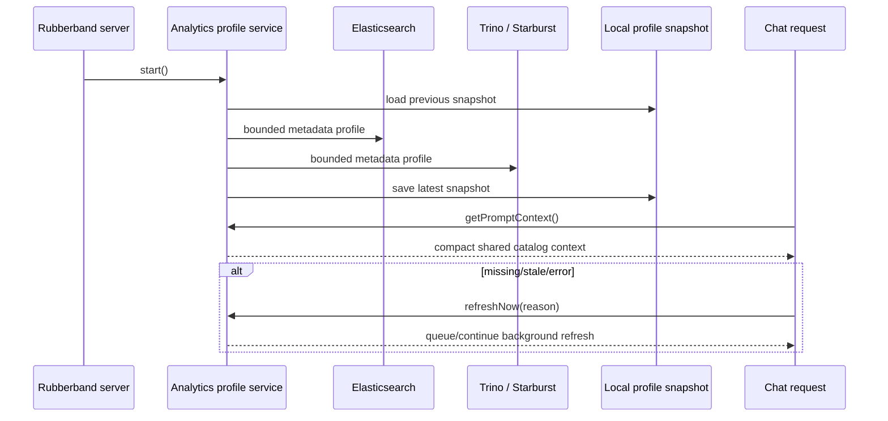
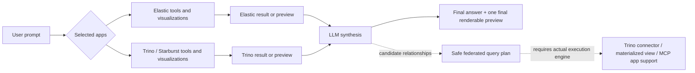
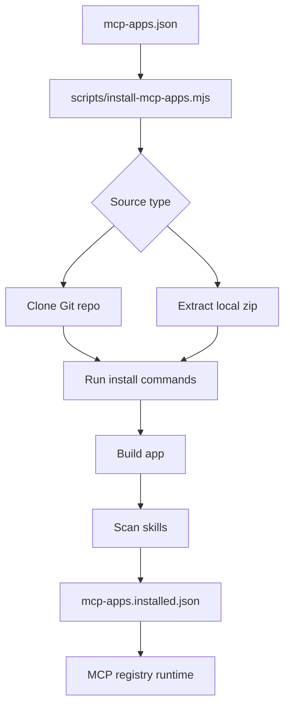
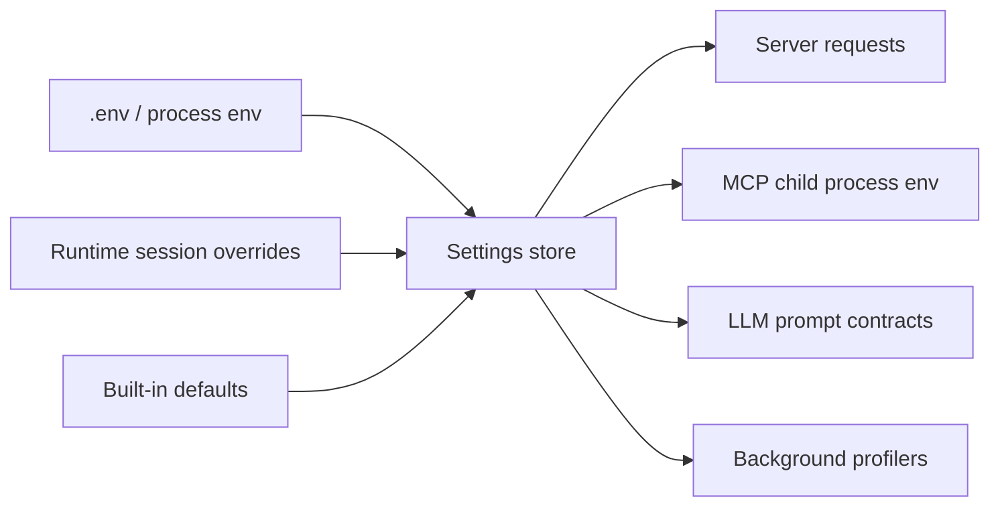
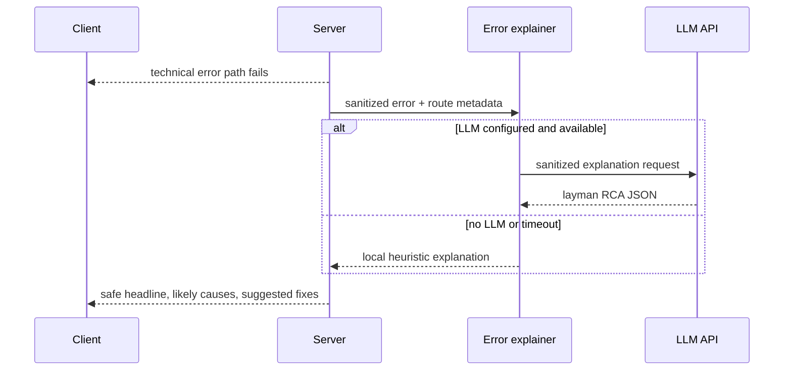

# Rubberband

Rubberband is a web chat host for analytics and visualization MCP Apps. It lets a user ask natural-language analytics questions, choose which MCP apps are available for that turn, render app previews inline, and interact with those previews without leaving the chat.

The default configuration installs Elastic MCP apps plus a Trino/Starburst visualization app. Rubberband is intentionally not tied to one backend: Elastic, Trino, Starburst, and future MCP analytics apps are treated as pluggable sources behind the same host, settings, visualization contract, and chat workflow.

Rubberband's own source code is MIT licensed. Default and optional MCP apps are third-party software with their own licenses; see `THIRD_PARTY_NOTICES.md`.

## Core Capabilities

- React chat UI with inline MCP App rendering through `@mcp-ui/client`.
- Express/TypeScript backend that owns MCP stdio or HTTP connections.
- OpenAI-compatible chat completion integration.
- LangGraph Deep Agents (`deepagents`) runner for bounded read-only Elastic and Trino/Starburst analysis.
- Instance-level MCP app/tool exposure policy plus per-chat app selection.
- Bidirectional MCP App bridge for iframe preview interactions and tool calls.
- Final-result preview handling so the user sees one final renderable result, not intermediate tool attempts.
- Background Elastic and Trino/Starburst metadata profiling shared by all users.
- Runtime settings UI with env-locked fields, session-scoped overrides, and connection tests.
- Host-side read-only MCP guard that hides write-capable tools and blocks mutating SQL/API arguments.
- Layman error explanations with sanitized context.
- Suggested follow-up actions/questions.
- Multimodal image attachments and paste support.
- Chat export to GitHub-flavored Markdown ZIP, DOCX, and PDF with preview images preserved.
- Browser voice-to-text input where supported.
- Docker build-time MCP app installation from Git or local zip.

## High-Level Architecture



## Runtime Component Map

| Area | Main files | Responsibility |
| --- | --- | --- |
| Browser host | `src/client/main.tsx`, `src/client/styles.css` | Chat state, app selection, settings UI, AppRenderer bridge, preview controls, local history. |
| API server | `src/server/index.ts` | Express routes, static client hosting, SSE progress stream, request error handling. |
| Chat orchestration | `src/server/openai-chat.ts` | OpenAI-compatible chat loop, MCP tool schema conversion, final-preview selection, follow-up suggestions, deep-analysis routing. |
| LangGraph Deep Agents | `src/server/deep-agent-runner.ts` | `deepagents` runner with read-only Elastic and Trino/Starburst profiler tools backed by `ChatOpenAI`. |
| MCP lifecycle | `src/server/mcp-registry.ts`, `mcp-apps.installed.json` | App manifest loading, stdio/HTTP client lifecycle, tool/resource/prompt proxies, environment passthrough. |
| Runtime settings | `src/server/settings.ts`, `src/server/session.ts` | Env-backed locked settings, per-session overrides, reconnect behavior. |
| Analytics profiling | `src/server/analytics-profile-service.ts`, `src/server/elastic-profiler.ts`, `src/server/trino-profiler.ts` | Bounded metadata cache for Elastic and Trino/Starburst. |
| Error explanation | `src/server/error-explainer.ts` | Secret redaction, local fallback explanations, optional LLM-generated RCA/fix guidance. |

## Chat Request Flow



Rubberband keeps only the latest renderable MCP result for a chat response. If the model or app produces multiple visual previews during a tool loop, intermediate previews are treated as implementation detail and not shown as separate final cards.

## MCP App Preview And Apply Flow



This is the bidirectional path used by apps such as `mcp-app-trino`. The app owns its native preview controls, while Rubberband owns the bridge, session auth, and host-side state replacement.

## Chat Export

Rubberband can export the current visible chat from the top bar:

- GitHub-flavored Markdown as a ZIP containing `chat.md` plus an `assets/` directory.
- DOCX with chat text and embedded images.
- PDF with chat text and embedded images.

Exports include user image attachments, `data:image/*` payloads returned by tools, and browser-captured MCP preview frames where the rendered preview is available in the chat.

## Background Analytics Profile Flow



Profiling is intentionally read-only and bounded. It collects metadata, not full data scans. Chat uses the latest successful snapshot so users do not wait for catalog discovery during normal prompts.

## Deep Analysis With LangGraph Deep Agents

Rubberband includes a LangGraph Deep Agents integration through the `deepagents` package. The implementation lives in `src/server/deep-agent-runner.ts` and uses:

- `createDeepAgent` and `StateBackend` from `deepagents`.
- `ChatOpenAI` from `@langchain/openai`, pointed at the same OpenAI-compatible provider settings used by normal chat.
- LangChain `tool(...)` wrappers with Zod schemas for bounded read-only profiler calls.

Deep-analysis routing starts in `src/server/openai-chat.ts`. The chat composer includes a **Deep Analysis** toggle that sends the request through a LangGraph Deep Agent orchestrator with the selected MCP tools still available, so normal chart/dashboard prompts can still produce MCP Apps UI previews. Prompts containing terms such as `deep analysis`, `profile`, `analyze`, `index catalog`, `table catalog`, `canned analytics`, or `suggested questions` are also classified as analysis requests. Target detection maps keyword-triggered profile requests to:

- `elastic`: Elastic / Elasticsearch index analysis.
- `trino`: Trino or Starburst catalog/table analysis.
- `all`: federated or cross-source Elastic plus Trino/Starburst analysis.

When the toggle is off, keyword-triggered analysis first uses `AnalyticsProfileService` so repeated analysis prompts can answer from the shared background profile snapshot without making users wait for catalog discovery. When **Deep Analysis** is toggled on, Rubberband uses a direct Deep Agent workflow over the selected MCP tools and instructs the agent to call visualization tools for chart, dashboard, and preview requests instead of only describing them.

The Deep Agents runner exposes two read-only tools:

- `profile_elastic_cluster_readonly`: inspects bounded Elasticsearch metadata and field capabilities. It does not write data, create aliases, update mappings, reindex, or scan full documents.
- `profile_trino_starburst_readonly`: inspects bounded Trino/Starburst catalogs, schemas, tables, and columns through metadata queries. It does not write data or scan business table rows.

The agent system prompt requires the profiler tools before recommendations, forbids write/DDL/DML suggestions as part of the analysis, and requires caveats for bounded or inferred cross-source relationships. Domain Knowledge from settings is passed into the agent request so local context can guide recommendations without inventing unobserved tables, indices, fields, or join keys.

Deep Agent model settings:

- `OPENAI_BASE_URL`: normalized to the provider base URL, even if the configured value includes `/chat/completions`.
- `OPENAI_API_KEY`: reused for the Deep Agent `ChatOpenAI` model.
- `OPENAI_AUTH_SCHEME`: supports `Bearer`, `none`, or custom authorization schemes.
- `OPENAI_MODEL`: model name for Deep Agent reasoning.
- `OPENAI_TEMPERATURE`, `OPENAI_TOP_P`, `OPENAI_MAX_TOKENS`: optional Deep Agent model tuning.
- `OPENAI_TIMEOUT_MS`: shared normal-chat and Deep Agent LLM timeout.
- `OPENAI_EXTRA_HEADERS`: optional JSON object merged into Deep Agent provider headers.
- `DEEP_AGENT_LLM_TIMEOUT_MS`: direct Deep Agent LLM timeout, default `90000`.
- `DEEP_AGENT_RECURSION_LIMIT`: maximum LangGraph Deep Agent recursion steps, default `32`.
- `MAX_DEEP_AGENT_TOOL_CALLS`: maximum MCP tool calls during a Deep Analysis chat turn, default `24`.
- `MAX_DEEP_AGENT_RESULT_CHARS`: maximum compact MCP tool-result characters returned to Deep Agents, default `4000`.

## Federated Analytics Model

Rubberband can reason across selected Elastic and Trino/Starburst apps, but it keeps execution source-specific unless an app or backend can actually query both sides.



Recommended federated workflow:

1. Profile each source with bounded metadata.
2. Identify candidate relationships from names, fields, columns, and Domain Knowledge.
3. Use selected MCP apps to run source-specific queries or visualizations.
4. Treat cross-source joins as candidate designs until Trino, a materialized view, or a dedicated app can execute both sides.

## Installed MCP Apps

The default `mcp-apps.json` installs:

- `elastic/example-mcp-dashbuilder`
- `elastic/example-mcp-app-security`
- `elastic/example-mcp-app-observability`
- `metalshanked/mcp-app-trino`

Licensing boundary:

- Rubberband source is MIT licensed.
- The Elastic MCP apps above are Elastic License 2.0 upstream projects.
- The Trino visualization app above is MIT licensed upstream.
- Rubberband's MIT license does not relicense installed MCP apps.

During Docker build or `npm run mcp:install`, Rubberband:

1. Reads `MCP_APPS_CONFIG`, defaulting to `mcp-apps.json`.
2. Clones or extracts each configured app. The default config pins Git apps to commit SHAs so Docker builds do not silently float to a new upstream commit.
3. Runs each app's configured install/build commands.
4. Scans app skills from `skills/**/SKILL.md`.
5. Writes `mcp-apps.installed.json`.

At runtime, `McpRegistry` reads the installed manifest and starts each app using its configured transport.



## App Config Shape

Each app entry supports:

- `source`: `{ "type": "git", "url": "...", "ref": "<branch-or-40-char-commit-sha>" }` or `{ "type": "zip", "path": "./vendor/app.zip" }`
- `install`: command arrays run in the app directory during image build.
- `transport`: stdio or HTTP runtime connection details.
- `envPassthrough`: environment variables copied into the MCP app process.
- `skills`: generated at install time from discovered skill files.

Editing `mcp-apps.json` does not vendor app source into this repository. Run `npm run mcp:install` locally, or rebuild the Docker image, to install changed apps.

Docker images built from the default `Dockerfile` include installed MCP app source and build output. Treat those images as Rubberband plus bundled third-party MCP apps, not as an all-MIT distribution.

## Running With Docker

Build and run:

```powershell
docker build --pull -t rubberband-mcp-chat:latest .
docker run -d --name rubberband-mcp-chat --env-file "$(Resolve-Path .env)" -p 8765:8765 rubberband-mcp-chat:latest
```

The default image installs the apps from `mcp-apps.json` at build time. Review `THIRD_PARTY_NOTICES.md` and each upstream app license before publishing or redistributing an image.

Replace an existing local container:

```powershell
docker rm -f rubberband-mcp-chat 2>$null
docker build --pull -t rubberband-mcp-chat:latest .
docker run -d --name rubberband-mcp-chat --env-file "$(Resolve-Path .env)" -p 8765:8765 rubberband-mcp-chat:latest
```

Open:

```text
http://localhost:8765
```

To serve the whole app and API under a subpath, set `BASE_PATH`:

```env
BASE_PATH=/rubberband
```

Then open:

```text
http://localhost:8765/rubberband/
```

Health check:

```powershell
Invoke-RestMethod -Uri http://127.0.0.1:8765/api/health | ConvertTo-Json
```

Profile status:

```powershell
Invoke-RestMethod -Uri http://127.0.0.1:8765/api/analytics-profile | ConvertTo-Json -Depth 6
```

## Local Development

```bash
npm install
npm run mcp:install
npm run dev
```

Frontend:

```text
http://localhost:5173
```

Backend:

```text
http://localhost:8765
```

For local development without installed MCP apps, the UI still starts but app and tool lists will be empty.

## Tests

```bash
npm run check
npm run build
npm run test:api
npm run test:e2e
npm test
npm run test:docker
npm run test:live
```

Test behavior:

- `npm run check`: TypeScript checks server and client.
- `npm run build`: builds server and Vite client.
- `npm run test:api`: Node API smoke tests.
- `npm run test:e2e`: Playwright UI tests.
- `npm test`: build, API tests, and E2E tests.
- `npm run test:docker`: builds Docker image, starts it with `.env`, checks `/api/health` and `/api/settings`, then stops it.
- `npm run test:live`: makes one real chat request using `.env` LLM settings and an empty MCP manifest.

## Settings And Configuration

Rubberband reads configuration from:

1. Process environment and `.env`.
2. Runtime settings stored per browser session.
3. Built-in defaults.

Fields backed by environment variables are locked in the Settings UI. Unset fields can be edited at runtime. Saving integration settings reconnects MCP apps so child stdio processes receive updated environment values.

Settings sections are collapsed by default to keep the panel scannable.



Use the `ELASTICSEARCH_*` names consistently; legacy `ES_*` names are not read as primary Rubberband settings. The registry adds compatibility aliases for some Elastic app child processes where needed.

Use `TRINO_*` names for `mcp-app-trino`; `STARBURST_*` names are also passed through for compatible Trino apps.

## Key Environment Variables

### Server

- `PORT`: Express server port, defaults to `8765`.
- `BASE_PATH`: optional app/API mount path such as `/rubberband`. Leave unset or use `/` to serve from root. When set, app assets, API routes, SSE, and the MCP sandbox are served below this path.

### LLM

- `OPENAI_API_KEY`: enables model-driven chat.
- `OPENAI_BASE_URL`: OpenAI-compatible endpoint, defaults to `https://api.openai.com/v1`.
- `OPENAI_AUTH_SCHEME`: auth prefix for the `Authorization` header, defaults to `Bearer`. Set to `none` if your gateway expects the raw key.
- `OPENAI_MODEL`: model name, defaults to `gpt-4.1-mini`.
- `OPENAI_TEMPERATURE`: optional temperature for normal chat and Deep Agent calls.
- `OPENAI_TOP_P`: optional top-p value for normal chat and Deep Agent calls.
- `OPENAI_MAX_TOKENS`: optional output token limit for normal chat and Deep Agent calls.
- `OPENAI_TIMEOUT_MS`: optional normal-chat LLM timeout, also used by Deep Agent calls before `DEEP_AGENT_LLM_TIMEOUT_MS`.
- `OPENAI_EXTRA_HEADERS`: optional JSON object merged into provider request headers.
- `OPENAI_EXTRA_BODY`: optional JSON object merged into normal chat-completions request bodies.
- `MAX_TOOL_LOOPS`: maximum chat tool-call loop count.
- `MAX_TOOL_RESULT_CHARS`: maximum serialized tool result characters sent back to the model.
- `DEEP_AGENT_LLM_TIMEOUT_MS`: direct LangGraph Deep Agent LLM timeout, defaults to `90000`.
- `DEEP_AGENT_RECURSION_LIMIT`: maximum LangGraph Deep Agent recursion steps, defaults to `32`.
- `MAX_DEEP_AGENT_TOOL_CALLS`: maximum MCP tool calls during a Deep Analysis chat turn, defaults to `24`.
- `MAX_DEEP_AGENT_RESULT_CHARS`: maximum compact MCP tool-result characters returned to Deep Agents, defaults to `4000`.
- `MAX_CONTEXT_MESSAGES`: recent messages retained in model context.
- `MAX_CONTEXT_MESSAGE_CHARS`: per-message context truncation size.

### MCP Exposure And Tool Safety

- `MCP_ENABLED_APPS`: optional comma- or newline-separated allowlist of app ids or wildcard patterns. Empty means every installed app is eligible.
- `MCP_DISABLED_APPS`: optional comma- or newline-separated denylist of app ids or wildcard patterns. Deny rules win over allow rules.
- `MCP_ENABLED_TOOLS`: optional comma- or newline-separated allowlist of tool patterns. Use `appId:toolName`, for example `dashbuilder:create_chart` or `mcp-app-trino:*`. Empty means every tool from enabled apps is eligible.
- `MCP_DISABLED_TOOLS`: optional comma- or newline-separated denylist of tool patterns. Deny rules win over allow rules.
- `MCP_READ_ONLY_MODE`: defaults to `true`. Rubberband hides and blocks MCP tools that appear to mutate external systems, and blocks mutating SQL/API arguments at execution time.
- `MCP_READ_ONLY_TOOL_ALLOWLIST`: optional wildcard list for tool-name false positives. Allowlisted tools are still checked for mutating SQL, HTTP methods, administrative endpoints, and write-like arguments.
- `MCP_EXPOSURE_REPORT_ON_STARTUP`: when `true`, logs an audit report of installed MCP apps, exposed tools, and items hidden by the instance or read-only policy during server startup.

Patterns are case-insensitive shell-style wildcards, not regular expressions. The exposure policy controls what the UI, model tool list, and host-side MCP proxy can use. Read-only mode is a separate Rubberband host guard layered on top. For defense in depth, use upstream credentials that only have read privileges.

Example: expose only Dashbuilder's selected preview tools and all Trino tools:

```env
MCP_ENABLED_APPS=dashbuilder,mcp-app-trino
MCP_ENABLED_TOOLS=dashbuilder:create_chart,mcp-app-trino:*
```

### MCP Apps

- `MCP_APPS_CONFIG`: build-time app installer config path.
- `MCP_APPS_MANIFEST`: runtime installed-app manifest path, defaults to `mcp-apps.installed.json`.
- `MCP_APPS_DIR`: directory used by the installer for app source.

### Elastic

- `ELASTICSEARCH_URL`
- `ELASTICSEARCH_CLOUD_ID`
- `ELASTICSEARCH_API_KEY`
- `ELASTICSEARCH_USERNAME`
- `ELASTICSEARCH_PASSWORD`
- `ELASTICSEARCH_AUTO_CREATE_API_KEY`: defaults to `false`. If enabled, Rubberband can create a temporary Elasticsearch API key from username/password for child MCP apps; leave disabled for strictly read-only deployments.
- `ELASTIC_CCS_SEARCH_BY_DEFAULT`: when `true`, Rubberband tells the model and background Elastic profiler to use configured cross-cluster search targets by default.
- `ELASTIC_CCS_INDEX_PATTERNS`: comma- or newline-separated CCS targets. Use `cluster:index-*` for explicit targets; alias-only patterns such as `remote-prod*` are normalized to `remote-prod*:*`.
- `ELASTIC_CCS_RESOLVE_TIMEOUT_MS`: bounded `_remote/info` and `_resolve/cluster` preflight timeout, defaults to `5000`.
- `CLUSTERS_JSON`: optional Elastic MCP cluster config override. If blank, Rubberband auto-generates the single-cluster JSON required by Elastic Security from `ELASTICSEARCH_URL`, `KIBANA_URL`, `KIBANA_SPACE_ID`, and `ELASTICSEARCH_API_KEY`.
- `CLUSTERS_FILE`: optional path to the same cluster config JSON. If set, Elastic Security prefers this over `CLUSTERS_JSON`.
- `KIBANA_URL`
- `KIBANA_SPACE_ID`
- `KIBANA_API_KEY`
- `KIBANA_USERNAME`
- `KIBANA_PASSWORD`

CCS patterns use Elasticsearch wildcard syntax, not regex. Rubberband resolves cluster alias wildcards case-insensitively during profiler preflight when Elasticsearch exposes matching remote aliases.

Elastic profiler controls:

- `ELASTIC_PROFILER_MAX_INDICES`
- `ELASTIC_PROFILER_MAX_FIELD_CAPS`
- `ELASTIC_PROFILER_MAX_FIELDS_PER_INDEX`
- `ELASTIC_PROFILER_TIMEOUT_MS`
- `ELASTIC_PROFILER_INCLUDED_PATTERNS`
- `ELASTIC_PROFILER_EXCLUDED_PATTERNS`
- `ELASTIC_PROFILER_INCLUDE_DATA_STREAMS`
- `ELASTIC_PROFILER_INCLUDE_SYSTEM`

Example large-cluster scope:

```env
ELASTIC_PROFILER_INCLUDED_PATTERNS=logs-*,metrics-*,traces-*,security-*
ELASTIC_PROFILER_EXCLUDED_PATTERNS=.*,ilm-history-*,slm-history-*
ELASTIC_PROFILER_INCLUDE_DATA_STREAMS=true
ELASTIC_PROFILER_INCLUDE_SYSTEM=false
```

### Trino / Starburst

- `TRINO_HOST`
- `TRINO_PORT`
- `TRINO_SCHEME`
- `TRINO_USER`
- `TRINO_PASSWORD`
- `TRINO_ACCESS_TOKEN`
- `TRINO_AUTH_TYPE`
- `TRINO_CATALOG`
- `TRINO_SCHEMA`
- `TRINO_SOURCE`
- `STARBURST_HOST`
- `STARBURST_PORT`
- `STARBURST_SCHEME`
- `STARBURST_USER`
- `STARBURST_PASSWORD`
- `STARBURST_ACCESS_TOKEN`
- `STARBURST_CATALOG`
- `STARBURST_SCHEMA`

Trino profiler controls:

- `TRINO_PROFILER_MAX_CATALOGS`
- `TRINO_PROFILER_MAX_TABLES_PER_CATALOG`
- `TRINO_PROFILER_MAX_COLUMN_TABLES_PER_CATALOG`
- `TRINO_PROFILER_MAX_COLUMNS_PER_CATALOG`
- `TRINO_PROFILER_INCLUDED_CATALOGS`
- `TRINO_PROFILER_EXCLUDED_CATALOGS`
- `TRINO_PROFILER_CONCURRENCY`
- `TRINO_PROFILER_CACHE_TTL_MS`
- `TRINO_PROFILER_TIMEOUT_MS`
- `TRINO_PROFILER_STATEMENT_TIMEOUT_MS`
- `TRINO_PROFILER_MAX_PAGES_PER_STATEMENT`

The default Trino profiler cache TTL is one day.

For large estates, prefer a catalog whitelist:

```env
TRINO_PROFILER_INCLUDED_CATALOGS=iceberg,hive
TRINO_PROFILER_MAX_CATALOGS=4
TRINO_PROFILER_MAX_TABLES_PER_CATALOG=30
TRINO_PROFILER_MAX_COLUMN_TABLES_PER_CATALOG=12
```

### TLS

- `ALLOW_INSECURE_TLS=true`: master insecure TLS switch for Rubberband server-side outbound requests and child MCP app processes.
- `TRINO_INSECURE_TLS`, `TRINO_CA_CERT_FILE`, `TRINO_CA_CERT`, `TRINO_CLIENT_CERT_FILE`, `TRINO_CLIENT_CERT`, `TRINO_CLIENT_KEY_FILE`, `TRINO_CLIENT_KEY`, `TRINO_CLIENT_KEY_PASSPHRASE`: optional Trino TLS and mTLS settings.
- `STARBURST_INSECURE_TLS`, `STARBURST_CA_CERT_FILE`, `STARBURST_CA_CERT`, `STARBURST_CLIENT_CERT_FILE`, `STARBURST_CLIENT_CERT`, `STARBURST_CLIENT_KEY_FILE`, `STARBURST_CLIENT_KEY`, `STARBURST_CLIENT_KEY_PASSPHRASE`: optional Starburst TLS and mTLS settings.

Use insecure TLS only for internal/self-signed certificates. Browser certificate validation for the user's HTTPS connection to Rubberband is still controlled by the browser and OS.

### Visualization Contract

- `RUBBERBAND_VIZ_THEME`
- `RUBBERBAND_VIZ_PALETTE`
- `RUBBERBAND_VIZ_DENSITY`
- `RUBBERBAND_VIZ_LEGEND`
- `RUBBERBAND_VIZ_TOOLTIP`
- `RUBBERBAND_VIZ_TIMEZONE`
- `RUBBERBAND_VIZ_NATIVE_FEATURES`

These defaults are included in model guidance and passed to app processes, so Elastic and Trino visualizations can use consistent themes and behavior without losing native app functionality.

### Background Profiler

- `ANALYTICS_PROFILER_ENABLED`
- `ANALYTICS_PROFILER_RUN_ON_STARTUP`
- `ANALYTICS_PROFILER_TARGETS`: `elastic`, `trino`, or `all`.
- `ANALYTICS_PROFILER_SCHEDULE_MS`
- `ANALYTICS_PROFILER_STALE_AFTER_MS`
- `ANALYTICS_PROFILER_STORAGE_FILE`

The default snapshot path is `.rubberband/analytics-profile.json`. Scheduled refreshes and stale checks default to one day.
If `ELASTIC_CCS_SEARCH_BY_DEFAULT=true`, the Elastic background profile includes the resolved CCS targets from `ELASTIC_CCS_INDEX_PATTERNS` before local index candidates.

## App Skills

During `npm run mcp:install`, Rubberband scans each installed MCP app for `skills/**/SKILL.md`. Discovered skills are written into `mcp-apps.installed.json`.

At chat time:

1. The user selects one or more apps.
2. Rubberband applies the instance MCP exposure policy.
3. Rubberband lists tools for the selected and enabled apps.
4. Rubberband injects selected app skills into the system prompt.
5. The model sees only the selected apps' exposed tools and relevant guidance.

This keeps context bounded and avoids leaking guidance from apps that are not selected for the turn.

## Visualization Interaction Events

MCP Apps can make important preview interactions visible to future chat turns by sending compact app messages through the MCP Apps bridge. Rubberband stores recent analytical events per preview and includes chat-visible events in the next model request.

Recommended event shape:

```json
{
  "type": "filter.applied",
  "summary": "status = failed",
  "details": { "field": "status", "value": "failed" },
  "chatVisible": true
}
```

Useful chat-visible events:

- `selection.changed`
- `filter.applied`
- `query.reran`
- `row.opened`
- `brush.selected`
- `drilldown.requested`
- time-range changes

Avoid sending hover, resize, focus, debug, or heartbeat messages as chat-visible events.

## Error Handling

Rubberband returns both technical errors and user-friendly explanations when possible.



The explainer sanitizes tokens, credentials, URLs, and stack-like details before sending context to an LLM.

## API Surface

Common endpoints:

- `GET /api/health`: server health.
- `GET /api/settings`: current settings snapshot.
- `POST /api/settings`: update runtime settings.
- `GET /api/events`: session progress event stream.
- `GET /api/apps`: MCP apps exposed by the instance policy.
- `GET /api/tools`: MCP tools currently exposed to the user after instance and read-only filtering.
- `GET /api/mcp/exposure`: audit report of installed apps, exposed/hidden apps, exposed/hidden tools, and active policy settings.
- `POST /api/apps/:appId/tools/call`: host-side app tool proxy.
- `POST /api/apps/:appId/resources/read`: app resource read proxy.
- `POST /api/apps/:appId/resources/list`: app resource list proxy.
- `POST /api/apps/:appId/resources/templates/list`: app resource template proxy.
- `POST /api/apps/:appId/prompts/list`: app prompt list proxy.
- `POST /api/chat`: chat orchestration.
- `GET /api/analytics-profile`: background profiler status.
- `POST /api/analytics-profile/refresh`: request profiler refresh.

When `BASE_PATH` is set, prefix all endpoints with that path. For example, `BASE_PATH=/rubberband` exposes health at `/rubberband/api/health`.

## Production Notes

- Run Rubberband behind HTTPS in shared environments.
- Keep `.env` out of source control.
- Prefer least-privilege read-only data source credentials.
- Use `MCP_ENABLED_APPS` and `MCP_ENABLED_TOOLS` to limit shared instances to the apps and tools users actually need.
- Keep `MCP_READ_ONLY_MODE=true` for shared deployments, and keep `ELASTICSEARCH_AUTO_CREATE_API_KEY=false` unless you explicitly accept that write.
- Keep profiler bounds conservative for large Trino and Elastic estates.
- Use include patterns/catalogs to scope profilers before increasing global limits.
- Treat `ALLOW_INSECURE_TLS=true` as a local/internal-only escape hatch.
- Set `BASE_PATH` when serving behind a reverse proxy subpath, and proxy the whole subpath to Rubberband.
- Review and pin third-party MCP app refs before production builds.
- Rebuild Docker after changing MCP app source config or upstream app refs.
- Restart or reconnect MCP apps after runtime integration setting changes.

## Troubleshooting

### MCP apps do not show as connected

Check:

```powershell
docker logs --tail 120 rubberband-mcp-chat
```

Common causes:

- App install failed during Docker build.
- `mcp-apps.installed.json` missing or stale.
- Required app environment variables are missing.
- App child process cannot start.
- App repo ref changed and image was not rebuilt.

### Trino profile is slow

Use tighter bounds:

```env
TRINO_PROFILER_INCLUDED_CATALOGS=iceberg,hive
TRINO_PROFILER_MAX_CATALOGS=4
TRINO_PROFILER_MAX_TABLES_PER_CATALOG=20
TRINO_PROFILER_MAX_COLUMN_TABLES_PER_CATALOG=8
TRINO_PROFILER_CONCURRENCY=2
TRINO_PROFILER_STATEMENT_TIMEOUT_MS=30000
TRINO_PROFILER_MAX_PAGES_PER_STATEMENT=40
```

The profiler is backgrounded, but it should still be bounded enough to avoid tying up metadata services.

### Elastic profiler returns 403

A `403` from Elasticsearch is usually credentials, permissions, or license/security feature state. Rubberband will surface the target as an error while still allowing other profile targets, such as Trino, to complete.

### Apply in a preview does not appear to update

The app must implement the bidirectional tool call and return an updated MCP UI payload. Rubberband proxies `onCallTool`, but only renderable MCP UI results replace the current preview; background polling/data calls stay local to the iframe. If a specific app still does nothing, inspect that app's bridge/tool implementation and server logs.

### Multiple visualizations appear for one chat turn

Rubberband is designed to show only the final renderable tool result for chat responses. If multiple previews appear, check whether they are from older chat messages, iframe-local UI inside one preview, or a custom app returning multiple visual artifacts in one payload.

## Repository Layout

```text
src/client/main.tsx                  React UI, chat state, AppRenderer bridge
src/client/styles.css                Client styling
src/server/index.ts                  Express server and API routes
src/server/openai-chat.ts            Chat orchestration and tool loop
src/server/deep-agent-runner.ts      LangGraph Deep Agents analysis runner
src/server/mcp-registry.ts           MCP app lifecycle, tools, resources
src/server/settings.ts               Settings model and runtime overrides
src/server/session.ts                Browser session isolation
src/server/progress.ts               Server-sent progress events
src/server/error-explainer.ts        Sanitized layman RCA/fix generation
src/server/mcp-tool-policy.ts        MCP exposure policy, read-only visibility, and call guard
src/server/analytics-profile-service.ts
                                     Shared background profile cache
src/server/elastic-ccs.ts           Elastic cross-cluster search settings and prompt helpers
src/server/elastic-profiler.ts       Bounded Elastic metadata profiler
src/server/trino-profiler.ts         Bounded Trino/Starburst metadata profiler
scripts/install-mcp-apps.mjs         Build-time MCP app installer
mcp-apps.json                        Default app install config
.env.example                         Configuration template
tests/api                            API smoke tests
tests/e2e                            Playwright UI tests
```

Use `.env.example` as the template. The checked-in `.env` should remain local-only.

## License

Rubberband source code is licensed under the MIT License. See `LICENSE`.

Default MCP apps, optional MCP apps, npm dependencies, external services, and generated installed-app artifacts are licensed separately by their respective owners. See `THIRD_PARTY_NOTICES.md`.
